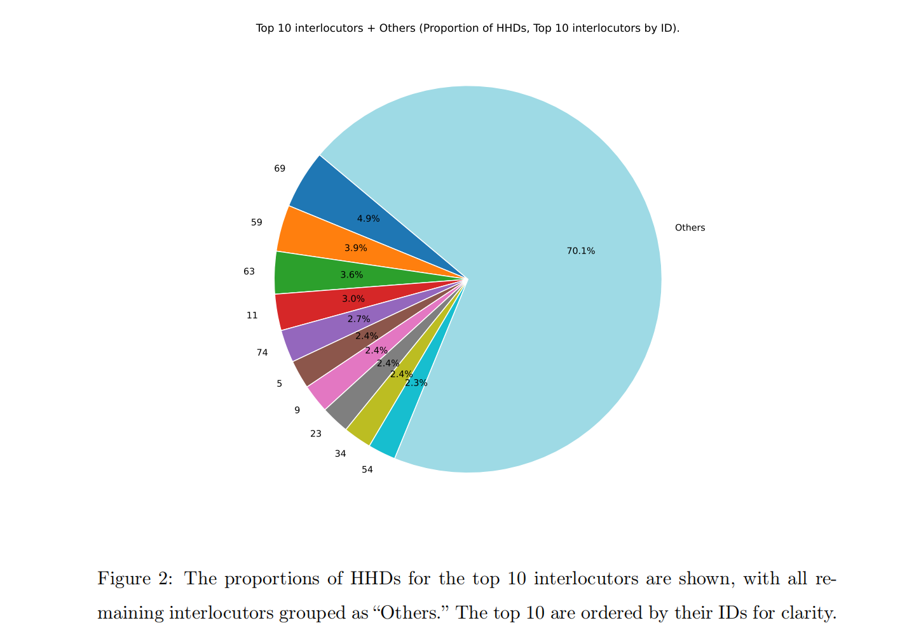
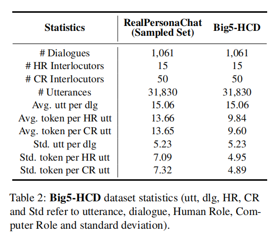
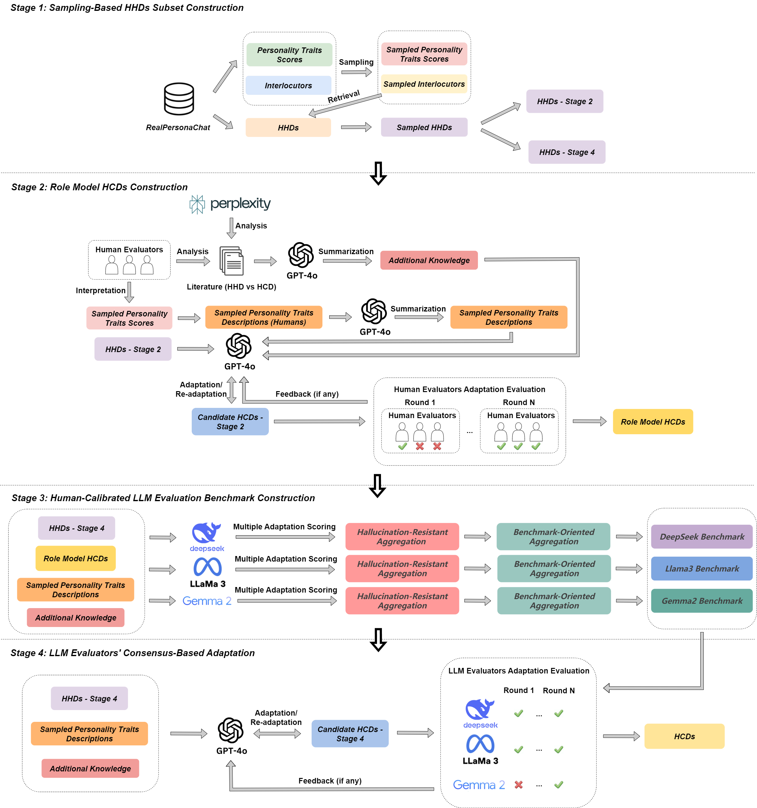
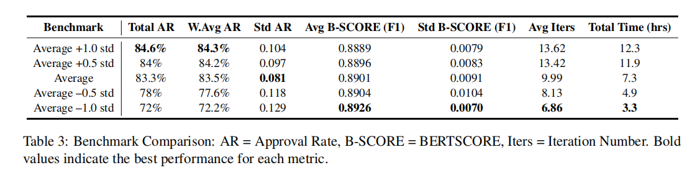
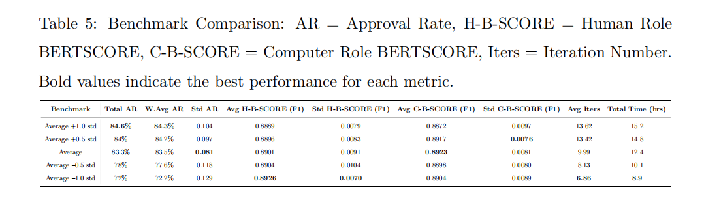

    <h1> Big5-HCD: A Human-Computer Dialogue Dataset with Personality Annotations via Semi-Supervised Adaptation </h1>

[//]: # (
  )

[//]: # (<a href="https://arxiv.org/pdf/2310.00746.pdf">Paper</a>; )

[//]: # (<a href="https://huggingface.co/datasets/ZenMoore/RoleBench">Data</a>)

[//]: # (
)

We introduce Big5-HCD, the first HCD dataset with fine-grained Big Five personality annotations. 

We provide demonstration data under ``LLMs_consensus_based_adaptation/data/``, which includes samples for different benchmark thresholds.

The whole dataset will be available on request. As this manuscript is currently under peer review, corresponding contact information will be made publicly available once the review process is completed1.

## Abstract

Personality-aware Human-Computer Dialogue (HCD) systems are critical for enabling personalized interactions. However, to the best of our knowledge, existing HCD datasets lack explicit personality trait annotations, creating a fundamental barrier to developing robust personality-aware HCD systems. To address this, we introduce \textbf{Big5-HCD}, the first HCD dataset with fine-grained Big Five personality annotations, derived from RealPersonaChat—a Human-Human Dialogue (HHD) dataset—through a four-stage pipeline: (1) Sampling-Based HHDs Subset Construction from RealPersonaChat; (2) Role Model HCDs Construction with human evaluators validation; (3) Human-Calibrated Large Language Model (LLM) Evaluation Benchmark Construction for automatic adaptation; (4) LLM Evaluators’ Consensus-Based Adaptation for HCD scaling. Experimental evaluations of adaptation effectiveness on Big5-HCD showed high approval rates and tolerance scores from human evaluators, confirming its reliability as a personality-annotated HCD dataset for developing personality-aware HCD systems.

## Dataset Statistics

## Pipeline

The four-stage semi-supervised pipeline of Big5-HCD: (1) Sampling-Based HHDs Subset Construction: Representative sampling of HHDs from RealPersonaChat via stratified personality trait selection and dialogue initiation filtering. (2) Role Model HCDs Construction: Human-AI co-creation combining expert annotations with Large Language Model (LLM)-based adaptation leveraging a subset of sampled HHDs. (3) Human-Calibrated LLM Evaluation Benchmark Construction: Multi-model calibration with hallucination-resistant and benchmark-oriented mitigation to establish quality benchmarks. (4) LLM Evaluators' Consensus-Based Adaptation: Automated, scaled adaptation of all sampled HHDs through benchmark-driven refinement cycles, ensuring quality control via consensus validation.

## Experiment Results

